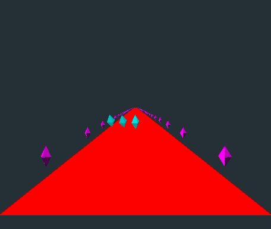

# Simple 3D engine

This project's goal is to help me to understand the underlying maths used in geometric calculations. Becasue of that, it uses
3x3 matrices and Gauss equation system rather than unifrom 4x4 matrices. 
